# Bank Management System
A console-based Bank Management application developed in C++ using Object-Oriented Programming principles.

---

## 📌 Project Description
This project is a bank management system where users can create accounts, perform transactions, and manage permissions through a bitwise access control system. The program also includes a Caesar cipher encryption feature for securing data. It was built to practice C++ fundamentals, OOP concepts, and file handling.

---

## 🛠️ Technologies Used
- C++
- Object-Oriented Programming (OOP)
- Console Application
- File Handling (.txt storage)

---

## 🎯 Features
- Client account creation and management
- Deposit and withdrawal transactions
- User login system with permissions
- Bitwise permissions system for access control
- Caesar cipher encryption for data security
- Simple and interactive console interface

---

## 🧠 What I Learned
- Bitwise operations and permission systems
- Basic encryption concepts (Caesar cipher)
- File handling and data persistence in C++
- OOP principles (classes and objects)
- Problem-solving and logic building

---

## 📷 Preview

  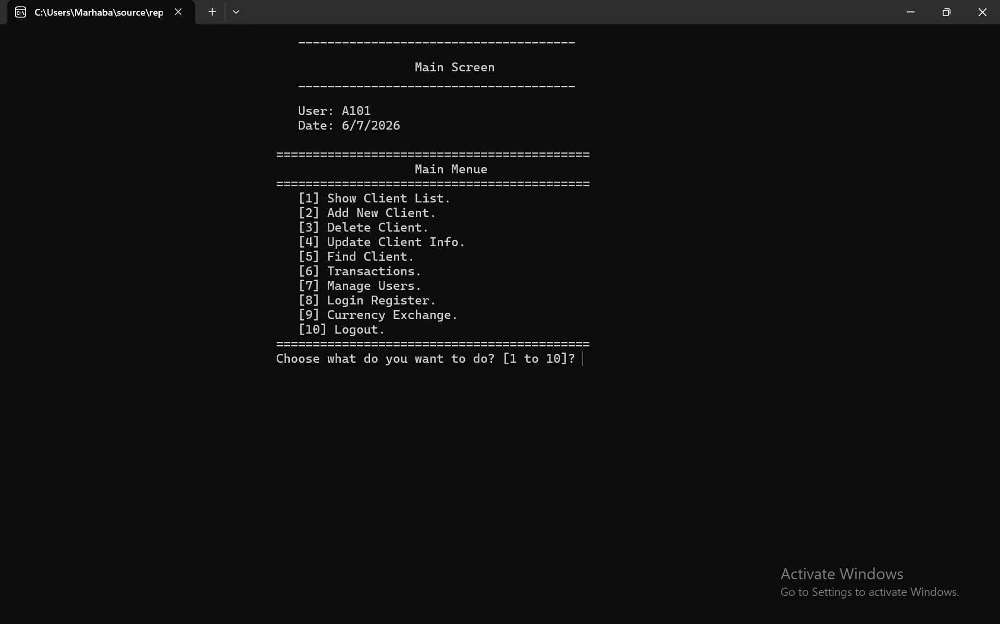
  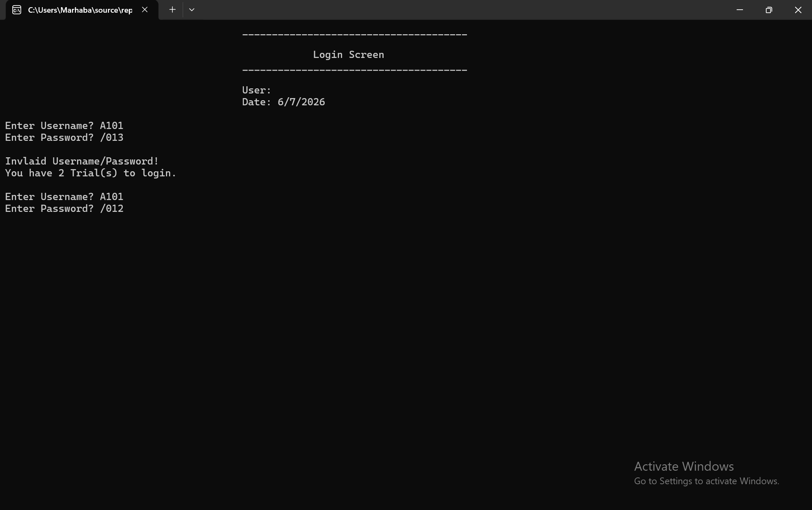
  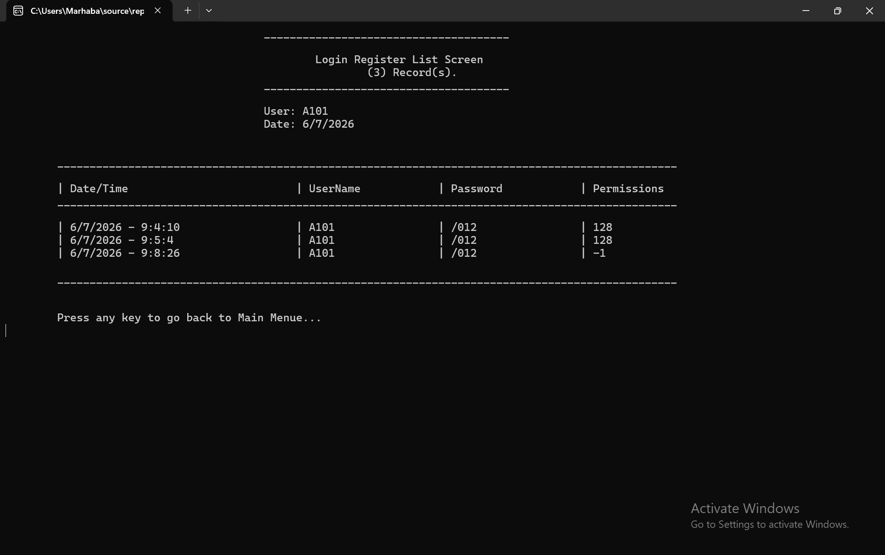

  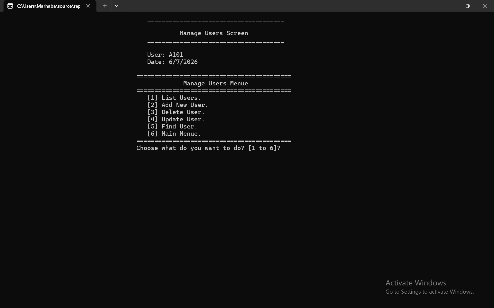
  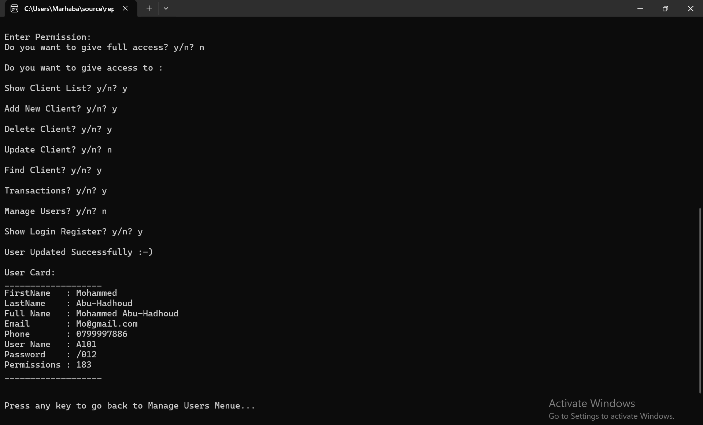
  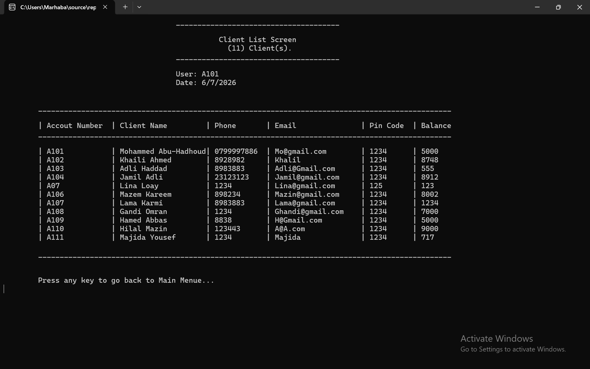

 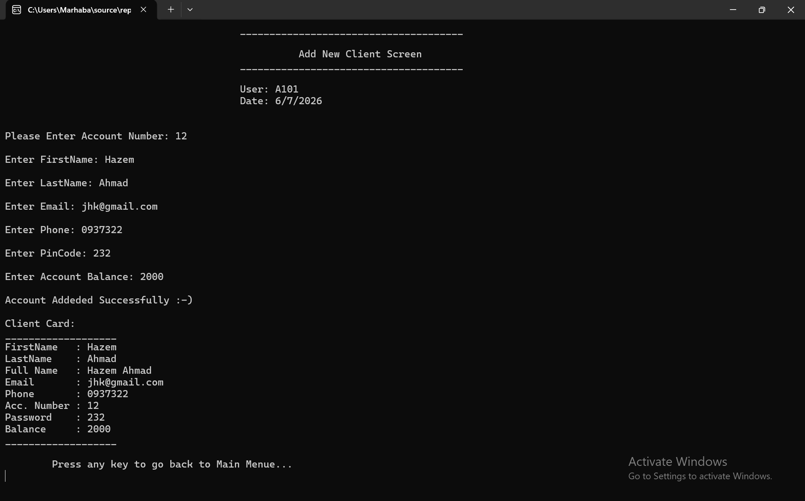
 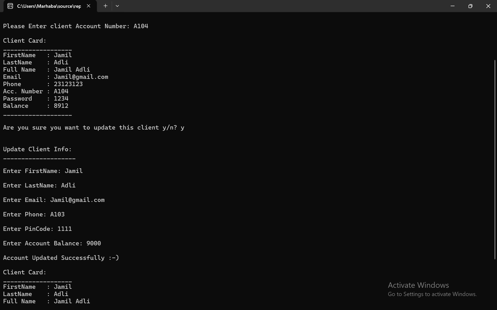
 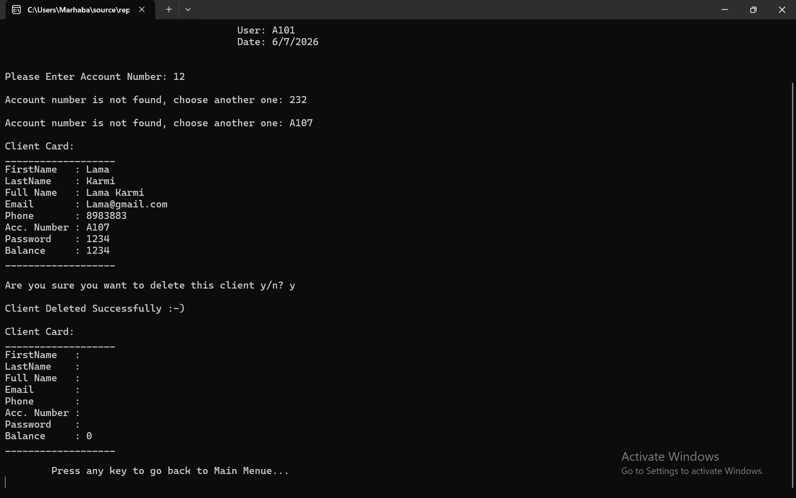

  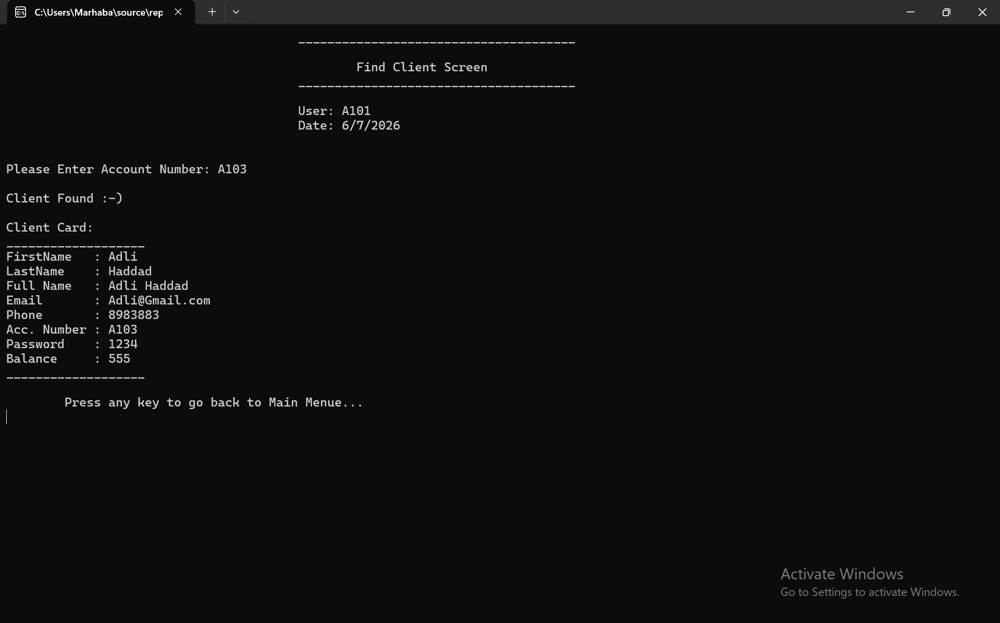
  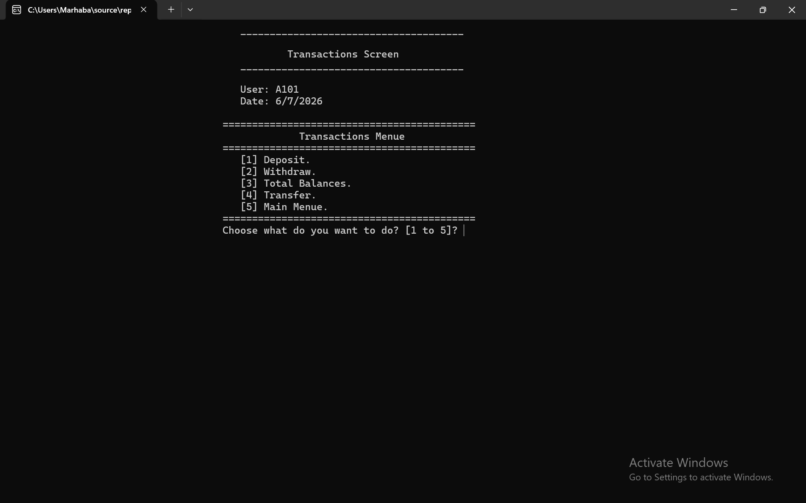
  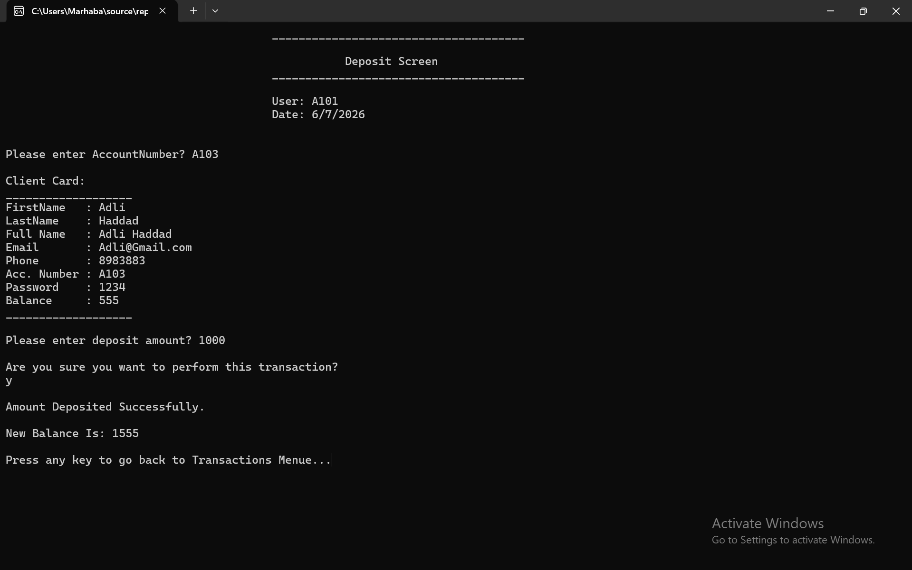

  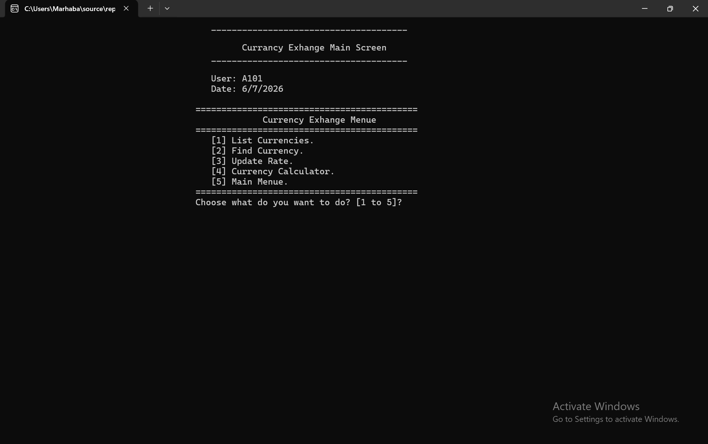
  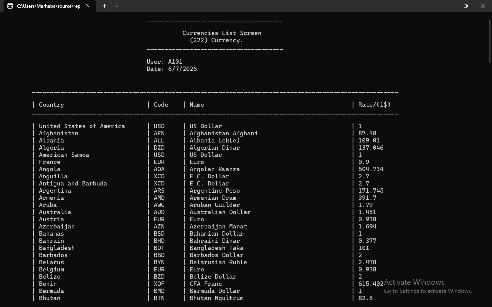
  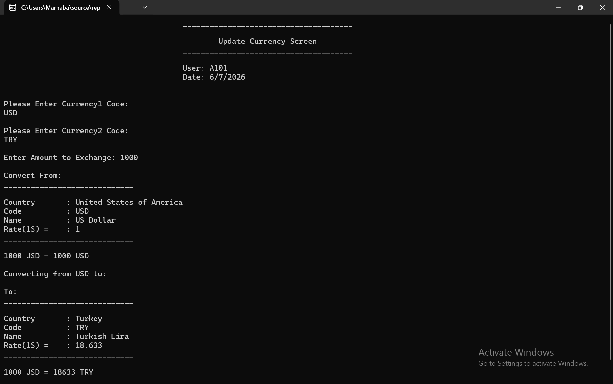

---

## ✍️ Author
Ealam Dhahir Taher  
- GitHub: https://github.com/EaloTaher
- LinkedIn: https://www.linkedin.com/in/ealam-taher
- Email: ealamtaher4@gmail.com
